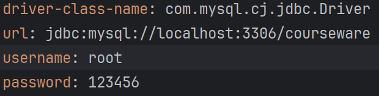

#### 1.主yaml里的img.uri，比赛时部署环境里面的地址记得改成http://localhost:10001/courseware/
#### 2.dev-yaml里的img.path和file.load.path记得改
#### 3.记得启用database-dev.yaml
#### 4.utils的request
#### 5.教师学生的ws连接
#### 6.transform的服务器地址
#### 7.画板的服务器路径
#### 8.D:/Tomcat/apache-tomcat-10.1.20/webapps/courseware/
### 注意 
##### tomcat里的webapps一定要是courseware（一定要启动tomcat）
##### nginx的draw端口号是80
##### vue可以是任意端口号
##### 记得改下面vue的shell的root
```shell
draw
server {
    listen 80;  #使用不同的端口号
    server_name your_second_project.local;

    location / {
        root   C:/nginx/html;
        index  index.html index.htm;
        try_files $uri $uri/ /index.html;
    }
}
```
```shell
vue
server {
    listen 81;
    server_name your_second_project.local;

    location / {
        root   C:\Users\lihao\Desktop\Geometry-Smart-ST\dist;
        index  index.html index.htm;
        try_files $uri $uri/ /index.html;
    }

    location /courseware/ {
        proxy_pass http://localhost:10001/;
        proxy_set_header Host $host;
        proxy_set_header X-Real-IP $remote_addr;
        proxy_set_header X-Forwarded-For $proxy_add_x_forwarded_for;
        proxy_set_header X-Forwarded-Proto $scheme;
    }
}
```


